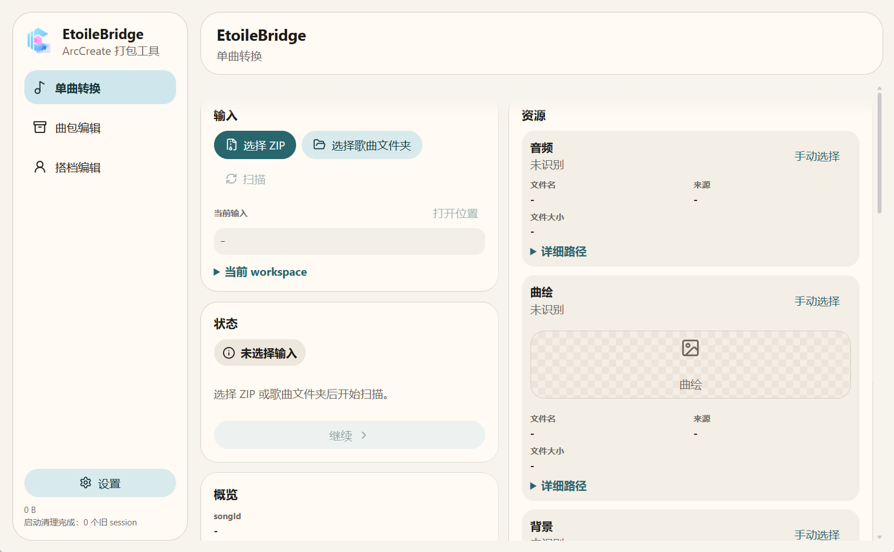
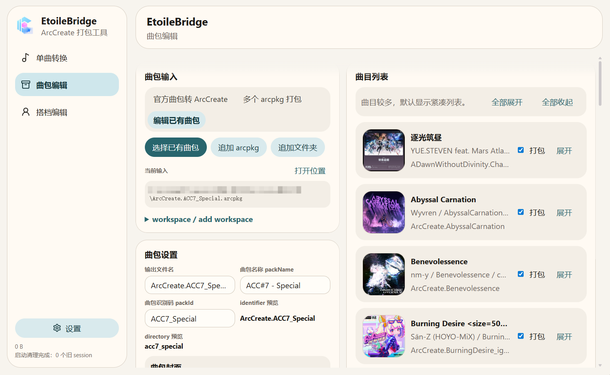
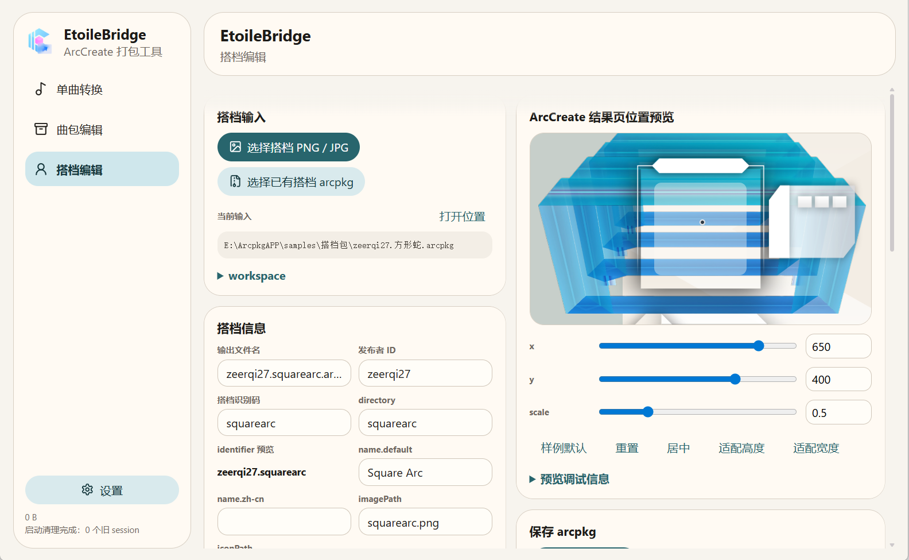

# EtoileBridge

EtoileBridge 是面向 ArcCreate 的谱面 / 曲包 / 搭档打包与编辑工具。
EtoileBridge is a package conversion and editing toolkit for ArcCreate.

This project is not affiliated with lowiro or the official ArcCreate team.

## Supported Platforms

- Android
- Windows

## Features

- Single Song conversion
- Pack Editor
- Character Editor
- ArcCreate appearance settings
- Resource preview and image detail dialogs
- Character result position preview
- Cache cleanup

## Android Usage

1. Install the release APK.
2. Import a ZIP or folder.
3. Edit metadata and resources if needed.
4. Save to Downloads or choose another output location.

## Windows Usage

1. Download the portable exe.
2. Double-click to run.
3. No Java, Node.js, npm, Gradle, or JDK installation is required.
4. Use the system save dialog to write `.arcpkg` files.

## Screenshots

Single Song

Pack Editor

Character Editor

## Related Projects / Credits

- ArcCreate: https://github.com/Arcthesia/ArcCreate  
  EtoileBridge is a tool built for ArcCreate package workflows.

- EtoileResurrection: https://github.com/freeze-dolphin/EtoileResurrection  
  EtoileBridge uses / adapts parts of the conversion ideas and logic from EtoileResurrection.

## Notes

- This is a preview release.
- Back up original charts and `.arcpkg` files before editing.
- If import or conversion fails, keep the logs and include them in reports.
- Complex packs or non-standard structures may still require manual correction.
- Auto-update is not configured yet.
- The Windows package is large because it includes a bundled runtime.
- Windows executable is currently unsigned and may trigger SmartScreen warnings.

## Feedback

Please include:

- Input type
- File structure
- Error logs
- Operating system version
- EtoileBridge version

## License

License: GPL-3.0
